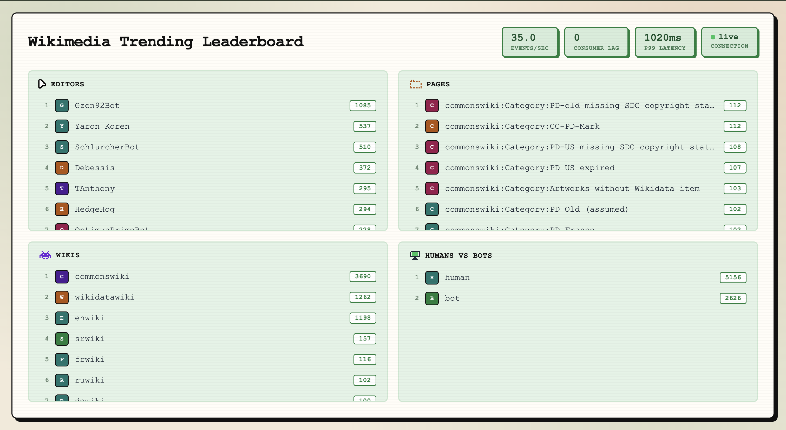

# Real-Time Trending Leaderboard

A live leaderboard over the public Wikimedia edit firehose — trending editors, pages, wikis, and humans-vs-bots, updated over a 5-minute sliding window.




## Quickstart

```bash
docker compose up -d
docker compose exec redpanda rpk topic create edits -p 4 -r 1 -c retention.ms=3600000
npm install
npm run producer     # in its own terminal
npm run aggregator    # in its own terminal
npm run api           # in its own terminal
open src/web/index.html
```

Verified from a clean clone: `docker compose up` brings up both services with no manual fixes (tested by cloning into a fresh directory and confirming Redpanda cluster info and a Redis `PING` both succeed).


## Architecture

```
   Wikimedia EventStreams (public SSE, ~30-45 events/sec, varies by time of day)
                    |
                    | one long-lived HTTPS GET
                    v
        +-------------------------+
        |  producer (Node)        |   normalize, stamp ingest_ts
        |  - SSE reader           |   tee raw events to capture file
        |  - backoff reconnect    |
        +-----------+-------------+
                    | kafkajs produce, key = entity
                    v
        +-------------------------+
        |  Redpanda (1 container) |   topic: edits, 4 partitions
        |  Kafka protocol         |   retention: 1 hour
        +-----------+-------------+
                    | consumer group: aggregator
                    v
        +-------------------------------------------+
        |  aggregator (Node)                        |
        |  - 300 x 1s bucket ring per dimension     |
        |  - exact counters + optional CMS          |
        |  - seals buckets, writes snapshots        |
        +-----------+-------------------+-----------+
                    | ZSET writes, once per second
                    v
        +-------------------------+
        |  Redis                  |
        |  lb:<dim>:win  ZSET     |
        +-----------+-------------+
                    | read side, polled at 4 Hz
                    v
        +-------------------------+
        |  api (Node, ws)         |  snapshot on connect
        |  - 250ms tick coalesce  |  deltas thereafter
        |  - latency histogram    |  measured here, server side
        +-----------+-------------+
                    | WebSocket
                    v
        +-------------------------+
        |  browser UI             |  4 panels, plain text rows,
        |  static HTML + JS       |  eps + latency badges
        +-------------------------+

   Offline tooling (results/ generation):
     replay.ts                reads capture file, produces at Nx for load tests
     bench.ts                 collects latency and lag into CSV for the results tables
     sketch-accuracy.ts       compares exact / CMS / Space-Saving at multiple budgets
     measure-exact-memory.ts  isolated heap measurement for the exact-counting baseline
     plot.py                  renders the three result PNGs from the CSVs
```

## The three headline numbers

**1. p99 producer-to-frame-emit latency: 1068ms.** p50 785ms, p95 988ms, from 122 real samples after optimization.


Method: sampled at the moment the API server broadcasts a real WebSocket delta, not on an independent timer, using the freshest known ingest_ts at that instant. See src/api/index.ts. This is the honest headline number: single machine, one clock, no skew.

**Source-to-ingest lag, indicative only. Steady state: p50 2110ms, p95 5107ms, p99 10503ms, p999 33116ms.** About 2,500 samples, excluding the first 2,000 events after every producer connect or reconnect. Kept separate from pipeline latency above, since it mixes in Wikimedia's own propagation delay and any clock skew on this machine, and their timestamp is only second-granular.

The steady-state split is necessary, not a formality. Last-Event-ID resume delivers a backlog of buffered events right after any reconnect, and each one carries a large source-to-ingest gap by construction, since it happened while we were disconnected. src/producer/index.ts tracks two histograms, ALL and STEADY-STATE, logged side by side every 500 events, so the distinction is always visible rather than something to account for afterward. How far they diverge depends on how long the connection was down. A short gap produced numbers within about 10% of each other. An earlier, longer outage produced an ALL p50 over 20 seconds, entirely a reconnect artifact. The steady-state number above is the honest one. Both readings are in results/results.md.

**2. Sustained throughput: tested up to 100x, the highest multiplier this plan specifies. Lag never diverged at any level.** Consumer lag stayed at 0 to 2 messages and resolved immediately across every multiplier, before and after optimization. The aggregator was never the bottleneck at any load we could generate, and its memory stayed bounded, never exceeding about 127MB RSS. Batching replay.ts's Kafka produces improved our own load generator's throughput substantially at moderate to high rates: 10x went from 71.9 to 262.0 events/sec mean, about 3.6x, and 50x from 380.5 to 543.6, about 1.4x. Returns diminished near 100x, 540.8 to 582.8 mean with a peak of 718.1/sec, where something else, likely file-read or JSON-parse speed, becomes the limit. **At 1x, batching made throughput slightly worse**, 51.1 to 41.8 events/sec mean. This is consistent with the mechanism: batching only pays off when enough volume queues up to flush together, and at real-time rate there is rarely more than one event waiting, so it pays a small coordination cost with nothing to amortize it against.


**3. Sketch memory reduction: about 249x, at 95% top-20 accuracy, over 15,404 distinct editors per window.** Exact counting with a plain Map costs about 1.4MB to hold that window, measured directly as an isolated process's heap delta. An earlier version of this measurement had a real bug that undercounted it by about 3x. See results/results.md. Space-Saving at a 5,638-byte budget holds 19 of the true top 20 editors with a 0.61% mean count error, a 249x reduction. At a 22,444-byte budget, still a 62.5x reduction, it matches the exact top 20 perfectly with 0.06% error. Count-Min Sketch is more memory-hungry for the same accuracy throughout. The plot and results/sketch-accuracy.csv have the full picture across both structures, 4 load levels of 25x, 50x, 75x and 100x, the last holding over a million real events, and 4 memory budgets.


## Design decisions

**Bucket-ring subtraction instead of recomputing the window.** Each dimension keeps a ring of 300 one-second buckets. Expiring a bucket costs work only for what is in that bucket, not the whole window. Recomputing the full 5-minute total every tick would get more expensive as the window fills, for no reason.

**Tick coalescing instead of a push per event.** At live rates a per-event WebSocket push would send around 40 or more frames per second to every client, far faster than a browser can usefully render. The API server instead polls Redis at 4 Hz and sends only what changed. This cuts frame volume by roughly 10x with no visible difference to a viewer.

**Redis persistence is off.** Redis here is a read-side cache and checkpoint store, not the source of truth. That is the Kafka log. If Redis is lost, the aggregator warm start rebuilds it from Kafka in a few seconds.

**Warm start replays the last 5 minutes on boot.** On startup the aggregator seeks every partition to now minus 300 seconds and replays forward, refilling the window in a few seconds instead of waiting 5 minutes for live traffic or resuming from a stale committed offset. Verified two ways. First, the immediate refill: a full 5-minute window within seconds of restart. Second, and more important, polling the window total every 30 seconds for 7 minutes after a restart to check for a cliff at the 5-minute mark. That cliff is what a version bucketing by wall-clock read time would show, as its wrongly crowded catch-up buckets all expired at once. The total moved smoothly instead, 11172 to 11004 to 10846 at the 270s, 300s, and 330s marks, with no discontinuity anywhere. Warm start also surfaced a real bug: a missing graceful-shutdown handler added over 20 seconds of Kafka rebalance delay to every restart. Fixed and confirmed with debug logs showing rejoin time drop from about 23s to single-digit milliseconds.

**Bucketing by ingest_ts, not by when the aggregator reads a message.** Events are bucketed by the timestamp the producer stamped at receipt, not by wall-clock time at consumption. These differ during backlog catch-up or fast replay. Bucketing by consumption time would cram minutes of events into one or two buckets, which looks correct until they all expire at once 300 seconds later.

## Limitations

- **Single node, at-least-once delivery.** A clean restart cannot double-count, since warm start replays into freshly cleared buckets. A mid-run consumer-group rebalance could double-count events within one bucket. This is rare and bounded on a single-consumer setup, and was deliberately not engineered around.
- **5-minute window only.** Nothing beyond the trailing 300 seconds is tracked or queryable.
- **Two fixes are correct by code reasoning, not yet proven by a real failure.** The empty-dimension Redis cleanup and the per-command Redis transaction error surfacing have never actually been triggered in testing. No dimension has gone empty and no Redis command has failed. Noted here instead of assumed correct. The ingest_ts-based warm-start bucketing was also in this category, until a 7-minute post-restart check ruled out the delayed-cliff failure mode. See Design decisions.
- **replay.ts's throughput is capped by its own produce mechanism, not the requested multiplier.** After batching, peak eps ranges from about 109 at 1x to about 743 at 50x, still well short of a literal 100x live rate. Batching raised throughput a lot at moderate to high rates but did not remove the ceiling. Something else, likely file-read or JSON-parse speed, becomes the limit near 100x.
- **replay.ts caps any single pacing gap at 2000ms (MAX_GAP_MS), which changes what replayed at Nx really means.** The capture file has real multi-minute gaps from our own testing history, not genuine Wikipedia quiet periods. Honoring those gaps fully, even compressed by the replay rate, stalled load tests longer than the test itself. The cap trades perfect timing fidelity for reliable amplified throughput. A genuine multi-minute quiet period gets compressed to at most 2 seconds regardless of replay rate. This is a deliberate, stated tradeoff, not an oversight.
