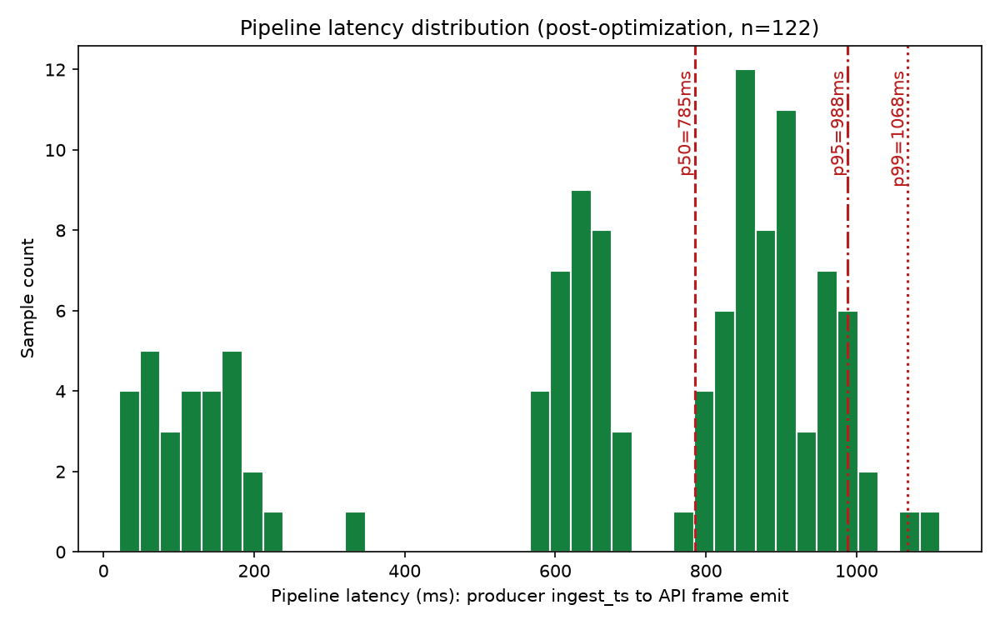
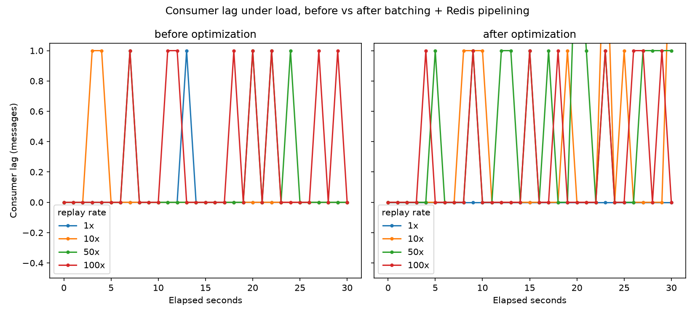
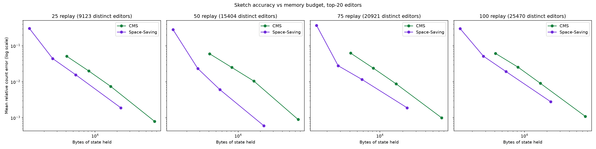

# Real-Time Trending Leaderboard

A live leaderboard over the public Wikimedia edit firehose — trending editors, pages, wikis, and humans-vs-bots, updated over a 5-minute sliding window.

> **Status:** the full pipeline (producer → Redpanda → aggregator → Redis → WebSocket API → UI) is built, running, and verified against live data. All three headline numbers below are real, measured, and reproducible — see `results/results.md` for the raw data behind each one. Only remaining gap: a saved screenshot file hasn't been captured into the repo yet.

## Quickstart

```bash
docker compose up -d
docker compose exec redpanda rpk topic create edits -p 4 -r 1 -c retention.ms=3600000
npm install
npm run producer     # in its own terminal
npm run aggregator    # in its own terminal
npm run api           # in its own terminal
open src/web/index.html
```

Verified from a clean clone: `docker compose up` brings up both services with no manual fixes (tested by cloning into a fresh directory and confirming Redpanda cluster info and a Redis `PING` both succeed).

To reproduce the numbers below:

```bash
npx tsx tools/replay.ts --file data/capture-<date>.jsonl --rate 50   # in a separate terminal, for load
npx tsx tools/bench.ts --out results/bench.csv --duration 30 --label "my-run"
npx tsx tools/sketch-accuracy.ts --file data/capture-<date>.jsonl
NODE_OPTIONS=--expose-gc npx tsx tools/measure-exact-memory.ts --file data/capture-<date>.jsonl --sample-size 525000
python3 -m pip install matplotlib   # one-time; plotting is the only Python in this project
python3 tools/plot.py
```

## Architecture

```
   Wikimedia EventStreams (public SSE, ~30-45 events/sec, varies by time of day)
                    |
                    | one long-lived HTTPS GET
                    v
        +-------------------------+
        |  producer (Node)        |   normalize, stamp ingest_ts
        |  - SSE reader           |   tee raw events to capture file
        |  - backoff reconnect    |
        +-----------+-------------+
                    | kafkajs produce, key = entity
                    v
        +-------------------------+
        |  Redpanda (1 container) |   topic: edits, 4 partitions
        |  Kafka protocol         |   retention: 1 hour
        +-----------+-------------+
                    | consumer group: aggregator
                    v
        +-------------------------------------------+
        |  aggregator (Node)                        |
        |  - 300 x 1s bucket ring per dimension     |
        |  - exact counters + optional CMS          |
        |  - seals buckets, writes snapshots        |
        +-----------+-------------------+-----------+
                    | ZSET writes, once per second
                    v
        +-------------------------+
        |  Redis                  |
        |  lb:<dim>:win  ZSET     |
        +-----------+-------------+
                    | read side, polled at 4 Hz
                    v
        +-------------------------+
        |  api (Node, ws)         |  snapshot on connect
        |  - 250ms tick coalesce  |  deltas thereafter
        |  - latency histogram    |  measured here, server side
        +-----------+-------------+
                    | WebSocket
                    v
        +-------------------------+
        |  browser UI             |  4 panels, plain text rows,
        |  static HTML + JS       |  eps + latency badges
        +-------------------------+

   Offline tooling (results/ generation):
     replay.ts              reads capture file, produces at Nx for load tests
     bench.ts               collects latency and lag into CSV for the results tables
     sketch-accuracy.ts     compares exact / CMS / Space-Saving at multiple budgets
     measure-exact-memory.ts  isolated heap measurement for the exact-counting baseline
     plot.py                renders the three result PNGs from the CSVs
```

## The three headline numbers

**1. p99 producer-to-frame-emit latency: 1068ms** (p50 785ms, p95 988ms; n=122 real samples, post-optimization).



Method: sampled at the moment the API server actually broadcasts a real WebSocket delta (not on an independent timer), using the freshest known `ingest_ts` at that instant (`src/api/index.ts`). This is the honest headline number — single machine, one clock, no skew.

**Source-to-ingest lag (indicative only), steady-state: p50=2110ms, p95=5107ms, p99=10503ms, p999=33116ms** (n≈2,500 samples, explicitly excluding the first 2,000 events after every producer connect/reconnect). Kept deliberately separate from pipeline latency above — this mixes in Wikimedia's own propagation delay and any clock skew on this machine, and their timestamp is only second-granular.

The steady-state/backlog split is a real, necessary distinction, not a formality: `Last-Event-ID` resume delivers a small backlog of buffered events right after any reconnect, each carrying an inherently large source-to-ingest gap by construction (they happened while disconnected). `src/producer/index.ts` tracks two histograms — `ALL` (everything) and `STEADY-STATE` (excludes the first 2,000 events after each connect) — logged side by side every 500 events, so this distinction is always visible, not something to remember to account for after the fact. How much they diverge depends on how long the connection was actually down: a short gap before reconnecting produced `ALL` and `STEADY-STATE` numbers within ~10% of each other; an earlier, longer outage produced an `ALL` p50 over 20 seconds, entirely a reconnect artifact. The steady-state number above is the honest headline; see `results/results.md` for both readings side by side.

**2. Sustained throughput: tested up to 100x (the highest multiplier this plan specifies), lag never diverged at any level.** Consumer lag stayed at 0-2 messages (transient, immediately resolving) across every multiplier, both before and after optimization — the aggregator was never the bottleneck at any load we could actually generate, and its own memory stayed bounded throughout (never exceeded ~127MB RSS at any tested load level). Batching `replay.ts`'s Kafka produces improved *our own load-generation tool's* throughput substantially at moderate-to-high rates (10x: 71.9 → 262.0 events/sec mean, ~3.6x; 50x: 380.5 → 543.6, ~1.4x) with diminishing returns near 100x (540.8 → 582.8 events/sec mean, peak 718.1/sec), where something else (likely file-read/JSON-parse speed) becomes the limit. **At 1x, batching made throughput slightly worse** (51.1 → 41.8 events/sec mean) — plausible and consistent with the mechanism: batching only pays off when enough volume queues up to flush together, and at real-time (1x) rate there's rarely more than one event waiting, so it's paying a small coordination cost with nothing to amortize it against.



**3. Sketch memory reduction: ~249x, at 95% top-20 accuracy, over 15,404 distinct editors per window.** Exact counting (a plain `Map<string,number>`) costs ~1.4MB to hold that window (measured directly, as an isolated process's heap delta — an earlier version of this measurement had a real bug that undercounted it by ~3x; see `results/results.md`). Space-Saving at a 5,638-byte budget holds 19/20 of the true top-20 editors with a 0.61% mean count error — a ~249x reduction. Pushed to a 22,444-byte budget (still a ~62.5x reduction), Space-Saving matches the exact top-20 perfectly (20/20) with 0.06% error. Count-Min Sketch is more memory-hungry for the same accuracy throughout this comparison — see the plot and `results/sketch-accuracy.csv` for the full picture across both structures, 4 load levels (25x/50x/75x/100x, the last holding over a million real events), and 4 memory budgets.



## Design decisions

**Bucket-ring subtraction instead of recomputing the window.** Each dimension keeps a ring of 300 one-second buckets. Expiring a bucket costs work proportional to what's *in* that bucket, not the whole window — recomputing the full 5-minute total on every tick would get more expensive as the window fills, for no reason.

**Tick coalescing instead of a push per event.** At live rates a per-event WebSocket push would send ~40+ frames/sec to every client, far faster than a browser can usefully render. The API server instead polls Redis at 4 Hz and only sends what actually changed — cuts frame volume by roughly 10x with no perceptible difference to a viewer.

**Redis persistence is off.** Redis here is a read-side cache and checkpoint store, not the source of truth — that's the Kafka log. If Redis is lost, the aggregator's warm start (below) rebuilds it from Kafka in a few seconds.

**Warm start replays the last 5 minutes on boot.** On startup, the aggregator seeks every partition to "now minus 300 seconds" and replays forward, refilling the window in a few seconds instead of either waiting 5 minutes of live traffic or resuming from a possibly-stale committed offset. Verified two ways: the immediate refill (a few seconds to a full 5-minute window after restart), and — the test that actually matters — polling the window total every 30s for 7 minutes after a restart and confirming no cliff around the 5-minute mark, which is where a version that bucketed by wall-clock read time instead of `ingest_ts` would show a sudden mass-expiry as the wrongly-crowded catch-up buckets all fell out of the window at once. The total moved smoothly through that window (11172 → 11004 → 10846 at the 270s/300s/330s marks) with no discontinuity anywhere across the full run. Warm start also turned up a real bug along the way — a missing graceful-shutdown handler was adding 20+ seconds of Kafka consumer-group rebalance delay to every restart — which is now fixed and confirmed via debug-level Kafka logs showing rejoin time drop from ~23s to single-digit milliseconds.

**Bucketing by `ingest_ts`, not by when the aggregator happens to read a message.** Events are bucketed by the timestamp the producer stamped at receipt, not by wall-clock time at consumption. Those two differ during backlog catch-up or fast replay, and bucketing by consumption time would cram minutes of events into one or two buckets — correct-looking until they all expire simultaneously 300 seconds later.

## Limitations

- **Single node, at-least-once delivery.** A clean restart cannot double-count (warm start replays into freshly-cleared buckets), but a mid-run consumer-group rebalance could double-count events within a single bucket. This is bounded and rare on a single-consumer setup, and deliberately not engineered around — see the plan's own scope decision on crash-recovery proving.
- **No crash-recovery verification.** Cut from scope on purpose (see `realtime-leaderboard-plan.md` section 1) — this is a 2-day project, not a durability audit.
- **5-minute window only.** Nothing beyond the trailing 300 seconds is tracked or queryable.
- **Two fixes are correct by code reasoning, not yet exercised by a real failure.** The empty-dimension Redis cleanup and the per-command Redis transaction error surfacing have never actually been triggered in testing (no dimension has gone empty; no Redis command has actually failed). Noted here rather than silently assumed correct. (The `ingest_ts`-based warm-start bucketing was in this category too, until a 7-minute post-restart check specifically ruled out the delayed-cliff failure mode — see Design decisions.)
- **`replay.ts`'s achievable throughput is capped by its own produce mechanism, not the requested multiplier** — post-batching, peak eps ranges from ~109 (at 1x) to ~743 (at 50x) depending on multiplier and burst timing, still well short of literal 100x live rate. Batching (section 6.3) raised this substantially at moderate-to-high rates but didn't remove the ceiling entirely; something else (likely file-read/JSON-parse speed) becomes the limit near 100x.
- **`replay.ts` caps any single inter-event pacing gap at 2000ms (`MAX_GAP_MS`), which quietly changes what "replayed at Nx" means.** The capture file has real multi-minute gaps from our own testing history (producer restarts during earlier work), not genuine Wikipedia quiet periods. Faithfully honoring those gaps — even compressed by the rate — stalled load tests for longer than the whole test window. The cap trades perfect timing fidelity for a load test that reliably delivers consistent amplified throughput, which is what section 6.3 actually needs. A genuine multi-minute quiet period (real or artificial) gets compressed to at most 2 seconds regardless of replay rate — a deliberate, stated distortion, not an oversight.
